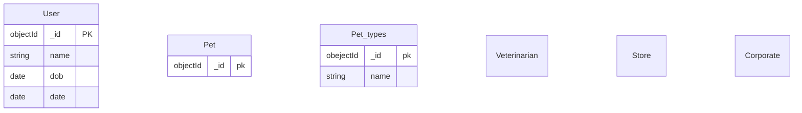

# Data Model app

```mermaid
erDiagram

User {
	objectId _id PK
	string name
	date dob
	date date
}

Pet {
	objectId _id pk
	
}

Pet_types {
	obejectId _id pk
	string name
}

Veterinarian {

}

Store {

}

Corporate {

}

```
